# Web App Part 3
This is homework 5 with required screenshots

## Tables of data in Pycharm
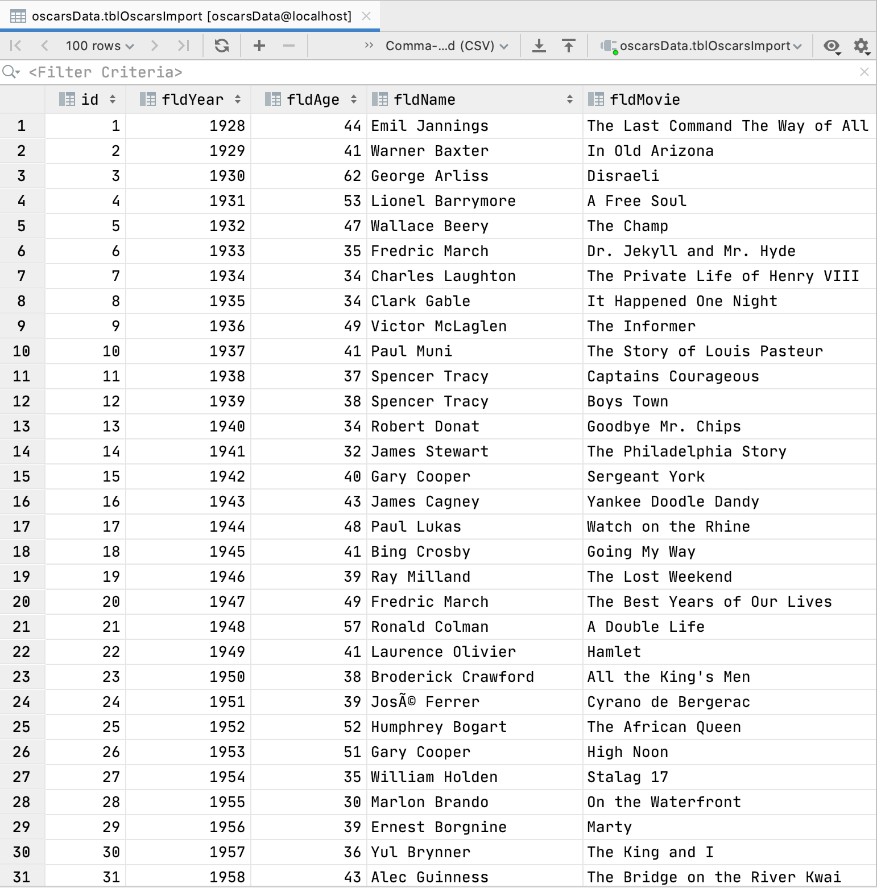

## Browser Homepage
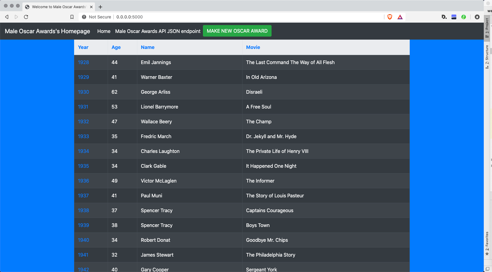

## View One Record
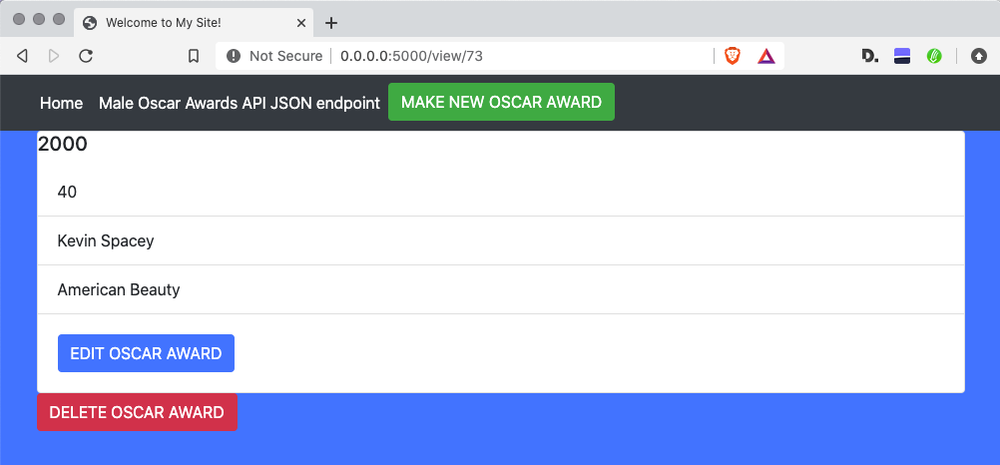

## Add New Record

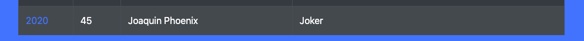

## Updated Record
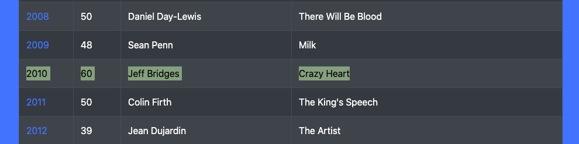

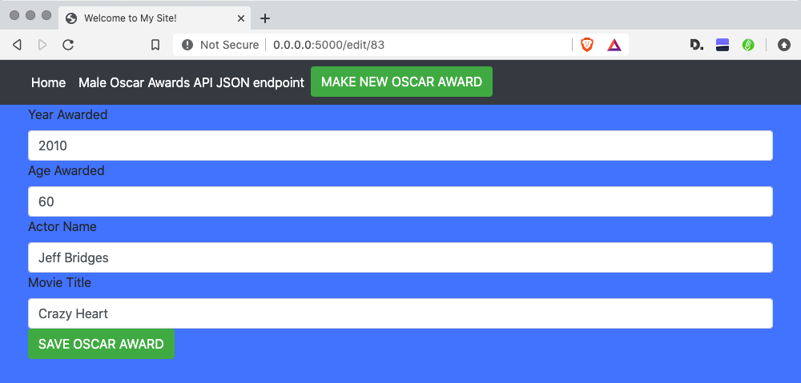

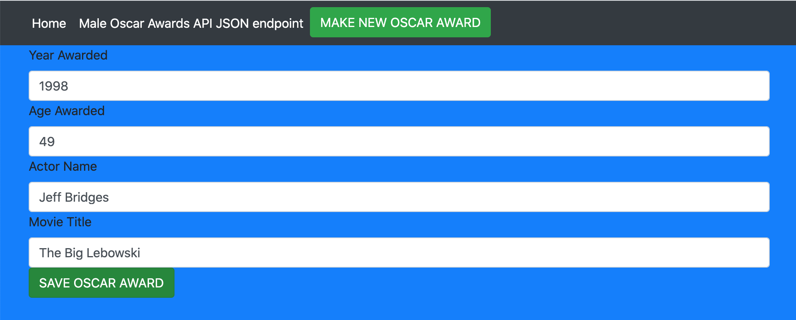

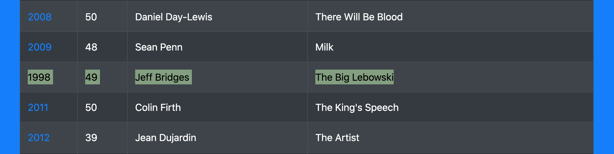

## Deleted Record
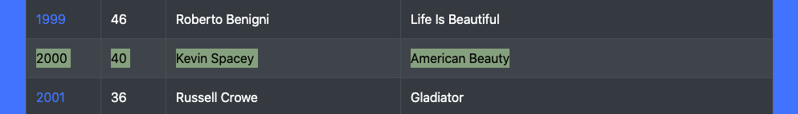

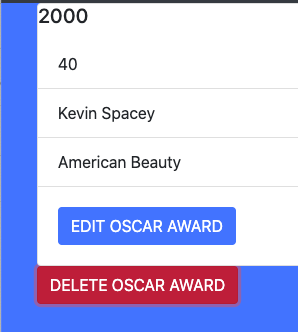

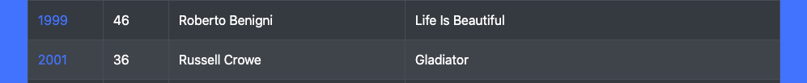